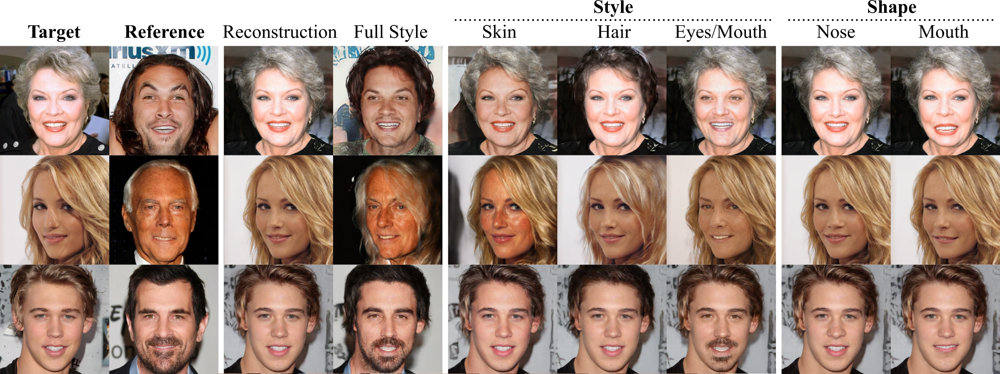

## CA2-SIS: Semantic Image Synthesis with Class-adaptive Cross-attention


**Figure:** *Face images style and shape editing with CA2-SIS*

[[Paper](PUT-LINK)]

Semantic Image Synthesis with Class-adaptive Cross-attention (CA2-SIS) enables high reconstruction quality, style transfer from a reference image both at global (full) and class level, and automatic shape editing.

### Installation

### Datasets Preparation
To run the pre-trained models and generate reconstructed images or train a new model, the user needs to download the CelebAMask-HQ dataset and put it inside a 'datasets' folder in the root directory.

Link to the CelebAMask-HQ dataset: https://drive.google.com/file/d/1TKhN9kDvJEcpbIarwsd1_fsTR2vGx6LC/view

### Generating Images Using Pre-trained Models

To run the pre-trained models, please download the related weights and put the files into a 'checkpoints' folder in the root directory:

[[CelebMask-HQ](https://drive.google.com/drive/folders/1Hvcm8epslPpehliyyr0I3HQHaXhvg-GV?usp=share_link)]
[[Ade20K (To be uploaded)](link)]
[[CityScapes (To be uploaded)](link)]

To test the pre-trained model run the following command:

```
python ./test.py --name [model_name] --exclude_bg \
    --sample_dir [results_path] --checkpoints_dir [checkpoint_path] \
    --batchSize 16 --crop_size [image_crop_size] --style_dim [stylecode_size] --load_size [image_size] --dataset_mode custom \
    --label_dir_test [test_label_path] \
    --image_dir_test [test_images_path] \
     --label_nc [num_classes] --no_instance --nThreads 4 --gpu_ids 0
```  
Options `model_name` can be `[celeba_model, ade_model, cityscape_model]`. The option `--exclude_bg` should be used only with CelebMask-HQ, and removed if testing on Ade20K or Cityscapes.

For example, to test on CelebMask-HQ you can run with the following options:

```
python ./test.py --name celeba_model --exclude_bg \
    --sample_dir ./results/train_celeba/ --checkpoints_dir ./checkpoints/train_celeba/ \
    --batchSize 16 --crop_size 256 --style_dim 256 --load_size 256 --dataset_mode custom \
    --label_dir ./datasets/CelebA-HQ/train/labels \
    --image_dir ./datasets/CelebA-HQ/train/images \
    --label_dir_test ./datasets/CelebA-HQ/test/labels \
    --image_dir_test ./datasets/CelebA-HQ/test/images \
     --label_nc 19 --no_instance --nThreads 4 --gpu_ids 0
``` 


### Train New Models

We trained our model on a single NVIDIA A100 GPU (40GB). The memory occupancy for training is non-negligible, so we recommend using a small batch size if training on GPUs with reduced memory.  

To train a new model, you need to specify the following options: TODO: list options

```
python ./train.py --name celeba_model --exclude_bg \
     --sample_dir ./samples/train_celeba/ --checkpoints_dir ./checkpoints/train_celeba/ \
    --batchSize 16 --crop_size 256 --style_dim 256 --load_size 256 --dataset_mode custom \
    --label_dir ./datasets/CelebA-HQ/train/labels \
    --image_dir ./datasets/CelebA-HQ/train/images \
    --label_dir_test ./datasets/CelebA-HQ/test/labels \
    --image_dir_test ./datasets/CelebA-HQ/test/images \
     --label_nc 19 --no_instance --nThreads 4 --gpu_ids 0
```   

### License
All rights reserved. Licensed under the [CC BY-NC-SA 4.0](https://creativecommons.org/licenses/by-nc-sa/4.0/legalcode) (**Attribution-NonCommercial-ShareAlike 4.0 International**) The code is released for academic research use only.


### Citation
If you use this code for your research, please cite our papers.

### Contacts
For any inquiries, feel free to contact tomaso.fontanini@unipr.it or ferrari.claudio88@gmail.com

### Acknowledgments
This code heavily borrows from the SEAN codebase https://github.com/ZPdesu/SEAN. 


